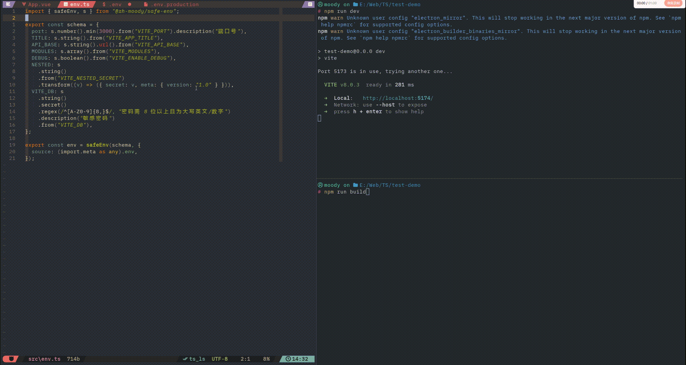

# @zh-moody/safe-env 🛡️

[](https://www.npmjs.com/package/@zh-moody/safe-env)
[](https://opensource.org/licenses/MIT)
[](https://github.com/zhMoody/safe-env)

简体中文 | [English](./README.en.md)

**告别 `undefined`！在应用启动的第一行，拦截所有配置隐患。**

无论你在写 Vue、React 还是 Node.js，环境变量配置永远是生产事故的高发区。`safe-env` 通过强类型 Schema 校验与运行时保护，确保你的应用始终运行在预期的配置之上。

---



---

### 🚀 核心特性

- **构建时预校验**：提供 Vite 插件，在开发启动或打包瞬间拦截非法配置。
- **敏感数据脱敏**：支持 `.secret()` 标记，确保密钥等敏感信息不会泄露在日志或报错表格中。
- **运行时深度冻结**：解析后的配置对象默认开启 `Object.freeze`，杜绝任何运行时的非法篡改。
- **Monorepo 精准定位**：支持 `cwd` 参数，可显式指定配置文件检索目录，适配复杂的项目架构。
- **IDE 增强**：支持 `.description()`，在代码中通过悬停直接查看变量用途与文档。
- **严谨的类型解析**：内置 `s.array()`, `s.boolean()` 增强转换，支持 `.transform()` 链式 Pipe 处理。

---

### 📦 安装 (Installation)

```bash
npm install @zh-moody/safe-env
```

---

### 🚀 快速上手

在开始之前，请确保你的项目根目录下已有相应的 **`.env`** 配置文件：

```bash
# .env 示例
VITE_API_URL=https://api.example.com
VITE_PORT=8080
```

#### 🔹 [Vite / React / Vue] 使用

在前端，建议配合 Vite 插件实现**构建时校验**。

**1. 配置 Vite 插件 (`vite.config.ts`)：**

```typescript
import { viteSafeEnv } from "@zh-moody/safe-env/vite";
import { schema } from "./src/env";

export default {
  plugins: [viteSafeEnv(schema)],
};
```

**2. 定义配置并导出 (`src/env.ts`)：**

```typescript
import { safeEnv, s } from "@zh-moody/safe-env";

export const schema = {
  VITE_API_URL: s.string().url().description("后端 API 地址"),
  VITE_PORT: s.number(3000).description("服务端口"),
};

export const env = safeEnv(schema, {
  source: import.meta.env,
});
```

> **💡 最佳实践：防止 Vite 类型污染**
> 为彻底禁用 `import.meta.env.XXX` 的原生提示，建议修改 `src/vite-env.d.ts`：
>
> ```typescript
> interface ImportMetaEnv {
>   [key: string]: never;
> }
> ```

---

#### 🔸 [Node.js / 服务端] 使用

在后端环境，库会自动检索并解析磁盘上的 `.env` 系列文件。

**1. 定义配置 (`src/config.ts`)：**

```typescript
import { safeEnv, s } from "@zh-moody/safe-env";

const config = safeEnv(
  {
    DB_PASSWORD: s.string().secret().description("数据库密码"),
    DB_PORT: s.number(5432).min(1).max(65535),
  },
  {
    // 在 Monorepo 或特定部署环境下，可显式指定 .env 所在目录
    // cwd: '/path/to/project-root'
  },
);

export default config;
```

---

### 🛠️ API 详解

#### 1. 全局配置与选项 (`safeEnv`)

`safeEnv(schema, options?)` 接收一个可选的配置对象，用于深度控制解析行为：

- **`useCache (boolean)`**: 是否启用全局缓存（默认 `true`）。开启后，后续调用将优先从内存获取已解析的配置，极大提升高频调用的性能。
- **`refreshCache (boolean)`**: 强制刷新并重新读取磁盘/进程变量（默认 `false`）。常用于开发环境下的热更新或自动化测试中切换不同的环境配置。
- **`cwd (string)`**: 显式指定 `.env` 文件的检索根目录（Node.js 环境）。
- **`source (Record<string, any>)`**: 手动指定数据源（如 `import.meta.env` 或 `process.env`），跳过自动文件检索。
- **`prefix (string)`**: 过滤环境变量的前缀（默认 `VITE_`）。

#### 2. 定义字段 (`s.xxx`)

- **`s.string(default?)`**: 字符串解析。
  - **逻辑**: 如果不提供默认值，该字段将被标记为 **必填 (Required)**，若 `.env` 中缺失会触发报错。
- **`s.number(default?)`**: 数字解析。
  - **逻辑**: 自动执行 `Number(v)`。若转换结果为 `NaN`（如 `VITE_PORT=abc`），解析会立即中止并报错。
- **`s.boolean(default?)`**: 增强布尔解析。
  - **逻辑**: 支持多种真假语义的自动转换：
    - **`true`**: `true`, `"true"`, `"1"`, `"yes"`, `"on"`。
    - **`false`**: `false`, `"false"`, `"0"`, `"no"`, `"off"`, 以及空字符串。
- **`s.array(default?, separator?)`**: 数组解析。
  - **逻辑**: 默认使用 `,` 作为分隔符。支持自定义，如 `s.array([], '|')`。
  - **示例**: `VITE_MODS=auth,cache` ➡️ `['auth', 'cache']`。
- **`s.enum(options, default?)`**: 枚举约束。
  - **逻辑**: 强制输入值必须在 `options` 数组中，否则报错。非常适用于多环境（`dev`, `prod`, `test`）的模式锁定。

#### 3. 校验与增强 (链式调用)

每个字段都可以通过链式调用进行深度定制：

- **`.secret()`**: 标记敏感数据，报错时该值会以 `********` 遮罩显示。
  ```typescript
  PASSWORD: s.string().secret();
  ```
- **`.optional()`**: 显式声明该字段为非必填。解析如果不存在，则返回 `undefined` 而不报错。
  ```typescript
  TRACKING_ID: s.string().optional();
  ```
- **`.requiredIf(fn)`**: 联动校验（Context-Aware）。依据当前已解析的其他配置动态决定该字段是否必填。
  ```typescript
  // 只有当 REGION 明确被设为 CN 时，ICP 备案号才是必填的
  ICP_NUMBER: s.string().requiredIf((ctx) => ctx.parsed.REGION === 'CN');
  ```
- **`.description(text)`**: 添加变量描述，映射到 IDE 悬停提示中。
  ```typescript
  PORT: s.number(3000).description("服务端口");
  ```
- **`.transform(fn)`**: 自定义数据转换，支持多级 Pipe。
  ```typescript
  NAME: s.string()
    .transform((v) => v.trim())
    .transform((v) => v.toUpperCase());
  ```
- **`.from(key)`**: 映射环境变量名（别名）。
  ```typescript
  port: s.number().from("VITE_SERVER_PORT");
  ```
- **`.min(n)` / `.max(n)`**: 限制数字取值范围。
  ```typescript
  PORT: s.number().min(1024).max(65535);
  ```
- **`.validate(fn, msg?)`**: 传入纯函数进行校验。支持上下文透传以及库内置高阶纯函数的直接切入（详情见下文 "内置验证库"）。
  ```typescript
  INTERNAL_URL: s.string().validate(
    (v, ctx) => v.endsWith(".internal.com"),
    "Must be internal",
  );
  ```

#### 4. 内置验证库

为了支持无限的业务规则而不造成构建体积膨胀，所有重型字符串校验（长正则）和转换规则均剔除出了核心类，化作了**支持完美 Tree-Shaking 的扁平化导出的高阶函数**。只有你明确通过 `import` 引用的微小单点代码才会被真正打包！

使用原生 `validate`/`transform` 方法无隙集成它们：
```typescript
import { safeEnv, s, isUrl, isIPv4, isUUID, isJSON, toJSON, trim } from "@zh-moody/safe-env";

const schema = {
  // 脏数据清理：先裁剪首尾空格、后校验 IPv4 格式
  HOST: s.string().transform(trim).validate(isIPv4, "必需是合法 IPv4"),
  // 支持链式序列化
  PAYLOAD: s.string().validate(isJSON).transform(toJSON),
  // 甚至只是普通的链接和格式判定
  API_URL: s.string().validate(isUrl, "必须抛出无效链接")
};
```

目前的 `@zh-moody/safe-env` 原生伴随导出了以下优质清洗函数组合，按需使用即可：
- **Validators (验证器)**: `isUrl`, `isEmail`, `isIPv4`, `isUUID`, `isBase64`, `isJSON`, `isHexColor`, `isObjectId`, `matchesRegex(pattern)`
- **Transformers (转换器)**: `trim`, `toLowerCase`, `toUpperCase`, `toJSON`

---

### 🎨 错误报告

当校验失败时，`safe-env` 会在控制台输出结构化的自适应表格，清晰展示：**Key / 错误原因 / 当前值（已脱敏）**。

---

### 📄 开源协议 (License)

[MIT License](./LICENSE) - Copyright (c) 2026 Moody.
